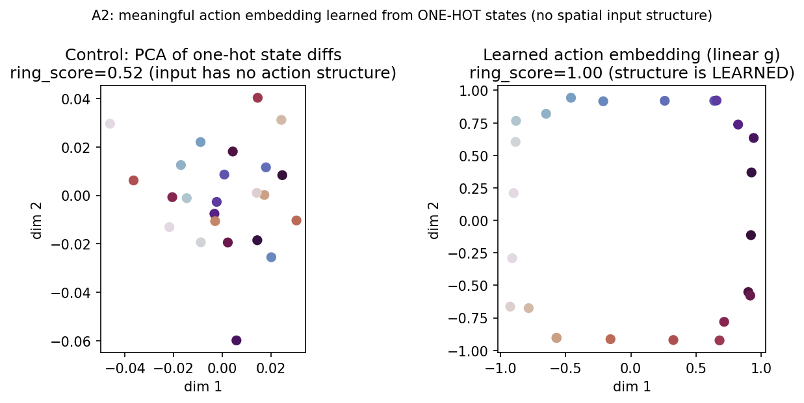
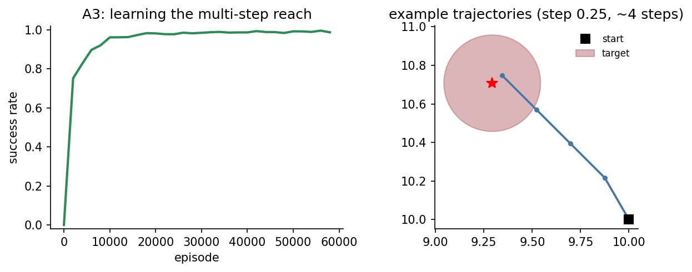
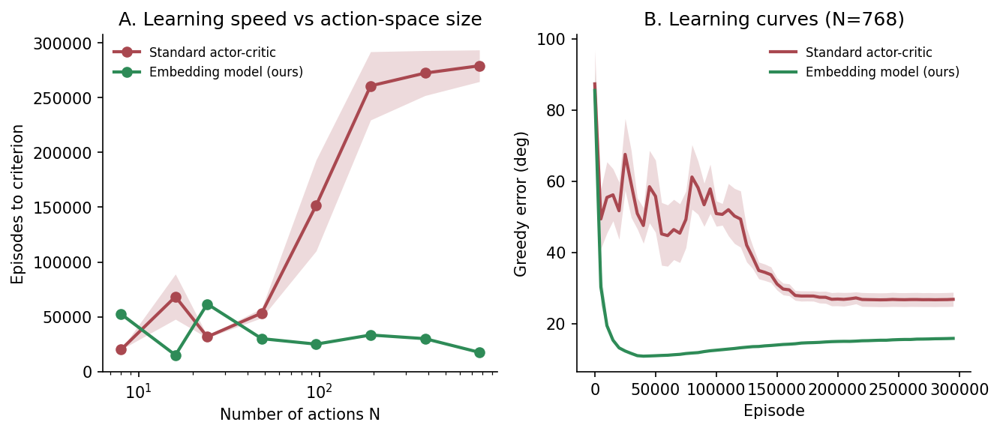
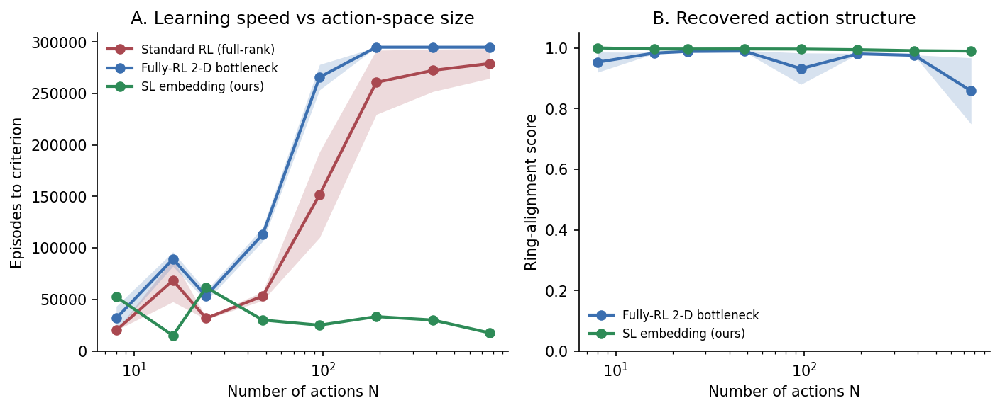
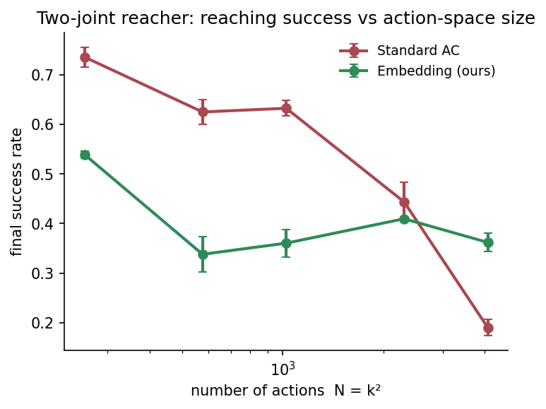
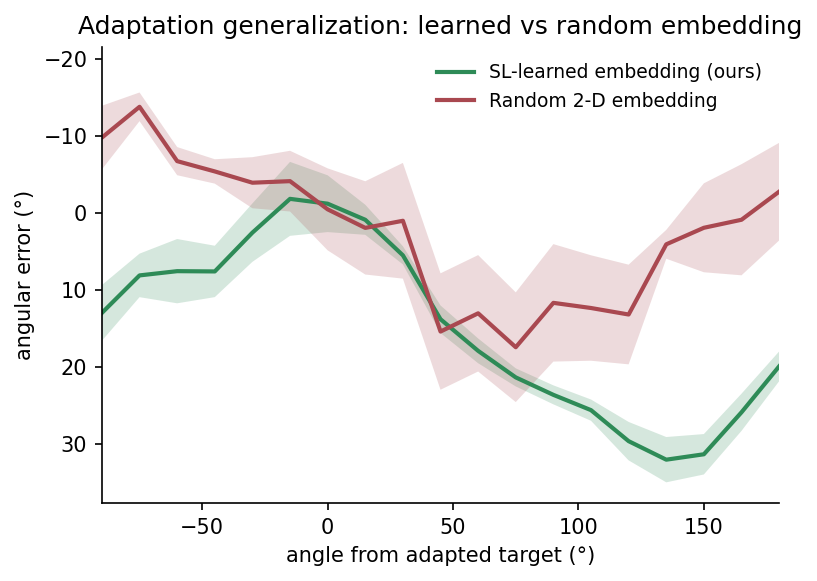
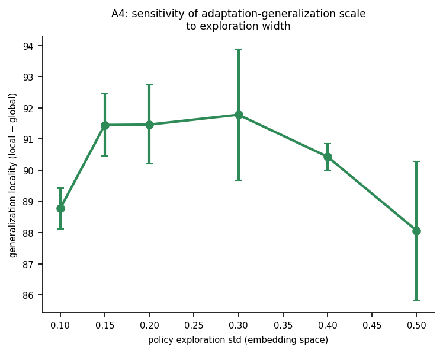

# Response to Reviewers — PCOMPBIOL-D-26-00710
### *Why motor learning involves multiple systems: an algorithmic perspective*

We thank both reviewers for their careful and constructive reviews. We were glad that both found the core idea novel and timely, and that the unified account of adaptation generalisation and dual-adaptation interference was seen as a valuable synthesis. Below we respond to every point in turn, following each reviewer's own numbering. New analyses added during revision are provided as **Supporting Information (SI)** figures and are named in each response; all are reproducible from the released code. Figure files referenced below live in `figures/revision_figures/`.

Changes to the manuscript are tracked in the marked-up copy; a per-edit map is maintained separately (`manuscript_changes.md`).

---

# Reviewer 1

> *"a timely and interesting idea that connects a machine learning literature on action representations to well-studied neural and behavioural phenomena… I recommend major revision."*

## Major issues

### 1.1 — Slow RL vs fast SL; Wang 2018 meta-learning; Hebbian cortex (foreground in Introduction)

> *"The paper calls RL 'slow' and SL 'fast', but … Wang 2018 propose meta-learning RL strategies that support rapid learning via neural activity … this framing seems less clear for cortex which is typically thought to learn slowly via Hebbian updates … it should be foregrounded in the introduction."*

We agree and have addressed this in the writing on three fronts:
1. A new **Discussion paragraph on meta-reinforcement learning** positions our proposal as *complementary* to Wang/Botvinick: their fast learner is a reward-meta-learned RL system capturing *task* structure in prefrontal cortex, whereas ours is a *supervised* system capturing *action* structure in cortico-cerebellar circuits — coexisting contributions of different circuits to the basal-ganglia learner. (Our embedding-pretraining is itself a form of amortised "learning to learn", but via supervision rather than meta-RL.)
2. We now explicitly **acknowledge the Hebbian-slowness tension** for cortex and resolve it: the speed-critical, error-driven component maps onto the cerebellum (the canonical fast supervised learner), so the slowly acquired, stable embedding (encoder *g*) can be cortical while fast recalibration (decoder *f*) is cerebellar; we also note recent evidence that neocortex can support faster error-based learning than the strict Hebbian view implies. This dovetails with our response to R2.2.

### 1.2 — State representation pre-encodes action structure (Fourier basis)

> *"the state representation is only a slightly obfuscated x/y coordinate … the top dimensions of a PCA of state differences φ(s') − φ(s) replicate the action structure … demonstrating that meaningful action representations can still be learned [with one-hot states] would be valuable."*

This is a fair and sharp point, and we have run the experiment the reviewer suggested. We removed **all** spatial structure from the state by using **one-hot** location codes in a grid world (every location mutually equidistant — no proximity in the input) and re-learned the action embedding. A near-perfect action **ring** is still learned (ring-alignment score 1.00), coloured smoothly by movement direction — and this holds even with a **linear** encoder, so it is not a capacity trick. Because one-hot states contain no metric information, any structure in the embedding must be learned from the transition statistics, directly answering the concern that the Fourier basis pre-encodes the answer.

*(New SI figure: `onehot_gridworld_linear`.)* We also acknowledge the reviewer's PCA observation in the text: the Fourier state does carry proximity structure, which is why the one-hot control is the decisive test. Relatedly (see **R1.4b**), a standard full-RL actor using the *same Fourier state* does **not** reproduce the local adaptation-generalisation profile — so the local generalisation is a property of the learned embedding, not of the Fourier state itself.

### 1.3 — Single-step tasks (add a sequential variant)

> *"add an experiment with sequential action, by producing a smaller action offset that requires multiple steps to reach the goal."*

We added a **multi-step** reaching variant: each action now moves a small step (0.25 units) so ~4 sequential steps are needed to reach a target at distance 1, with a per-step progress reward and a terminal bonus. The embedding is learned on the small-step transitions and an actor–critic learns *within* the embedding, so temporal-difference credit assignment now does real work across steps. The agent reliably learns the sequential reach (success 0 → ~0.99). Notably, the sequential task is only learnable with a shaped/dense reward — a purely sparse terminal reward over many small steps does not train — which is itself consistent with the paper's thesis that a learned action structure makes reward-based learning tractable.

*(New SI figure: `a3_multistep`.)* We also now acknowledge the single-step simplification explicitly in the main text (see also R2.5).

### 1.4 — Baseline comparisons

**(a) Efficacy is asserted, not demonstrated.**
> *"It would be worth showing that the method accelerates learning beyond a simpler policy gradient baseline method."*

We now demonstrate this **within our model**. In a multi-target centre-out reach we varied the number of actions N (8→768; 6 seeds; learning rates grid-tuned for a fair comparison) and compared the embedding model against a standard actor-critic. The embedding model's **learning speed** — episodes to reach a fixed accuracy criterion — is essentially **N-independent** (roughly flat), while the standard actor-critic's cost **explodes** with N (and its learning curve at large N remains far from convergence). This is a direct, in-model demonstration of the scaling advantage that was previously only asserted (and it also addresses R2.4).

We note honestly that in the *single-step, single-target* task there is no speed benefit (the manifold is ≈1-D); the advantage is a property of large, structured action spaces. *(New SI figure: `speed_vs_nactions`.)*

**(b) A fully-RL system with a low-rank projection/bottleneck.**
> *"to what extent these findings could be replicated by a fully RL-based system that has a simple low-rank projection / bottleneck … it is unclear whether it would show the same adaptation and interference profiles. Nonetheless, it seems worthwhile to include as a baseline."*

We implemented exactly this baseline — a fully-RL 2-D bottleneck actor-critic (`φ(target) → Linear(→2) → tanh → Linear(2→N) → policy`), trained end-to-end by reward, identical to our model except the 2-D code is shaped by reward rather than by supervision. Two findings:

*It recovers the structure but not the benefit.* Across N=8→768 (6 seeds, lr grid-tuned), the fully-RL bottleneck does recover the action ring (panel B; |ring-alignment| ≈ 0.98, like the SL embedding), but its **learning speed is no better than a standard full-rank RL actor** and far slower than the SL embedding (panel A; episodes-to-criterion rises steeply with N and fails to reach criterion at large N, whereas the SL embedding stays roughly flat). So a low-rank projection *per se* is not the source of the advantage — the advantage comes from learning the embedding by supervision.

*(New SI figure: `bottleneck_vs_sl_learning`.)*

On the **adaptation profile** specifically, we ran the identical single-target visuomotor-rotation generalisation test (the Fig 3I protocol) on a **standard full-RL actor** — same Fourier state, no learned embedding — with the same early-stopping. To make the comparison unambiguous we measure **adaptation transfer to untrained targets**: after adapting one target, how each *other* target's error changes relative to the un-adapted baseline (every untrained target starts at the 30° rotation error). Positive = the adaptation *generalised* (reduced that target's error); negative = it *interfered* (increased it). We summarise as bars rather than the full curve because the standard-RL profile is too disorganised across seeds to plot meaningfully — which is itself the point:

![Adaptation transfer to untrained targets (error reduced vs the un-adapted 30° baseline; positive = generalisation, negative = interference), for near (≤45° from the adapted target) and far (>45°) untrained targets. The SL embedding shows positive transfer that decays with distance (near +20°, far +8°) — local generalisation, as in humans (Fig 3I). The standard full-RL actor shows essentially no transfer nearby (+1°) and *negative* transfer far away (−17°): it compensates only the exact trained target and disrupts the rest. Mean ± s.e.m., 9 SL / 6 standard-RL seeds.](figures/revision_figures/adaptation_generalization_bars.png)

So the standard full-RL actor does **not** reproduce the local generalisation profile: adapting one target does not help its neighbours (transfer ≈ 0) and actively harms distant targets. This also directly addresses **R1.2**: local generalisation is a property of the *learned action embedding*, not of the Fourier state representation — a plain RL actor using the same state does not generalise.

Mechanistically, this is expected. A fully-RL system (bottleneck or full-rank) has no separable supervised decoder that can be recalibrated from sensory prediction error — it can only re-learn by reward, and therefore only at targets where reward is delivered. The human local-generalisation (Fig 3I) and dual-adaptation interference (Fig 4G) profiles arise in our model because recalibrating the shared *learned* decoder at one adapted target transfers automatically and locally to *untrained* neighbours. This is the deeper reason to prefer supervised embedding learning: the prediction objective is available on **every transition, rewarded or not**, so the system adapts from sensory prediction error without waiting for reward (as the cerebellum is thought to). The two learning signals are complementary — the "why multiple systems" thesis in miniature. (The random-embedding control, R2.6, makes the complementary point that these local profiles further require the structure to be *learned* rather than imposed.)

### 1.5 — Park 2025: large offsets that Park intentionally avoided (Fig 2C)

> *"either 1) directly simulate Park's conditions, or 2) more explicitly discuss why the large offset condition is included despite Park's theoretical reasons for excluding it."*

We now do both. (i) In the **main text** we state that the large ($165\degree$) offset is included to probe the model's prediction across the *full* similarity range — precisely where the selection and specification accounts diverge most — while making clear the quantitative comparison to Park is at the small separation. (ii) We also extend the interference analysis down to the smallest separation the 24-action grid resolves ($15\degree$, adjacent to Park's $10\degree$) and find interference is *strongest* there, recovering monotonically with separation (see R2.8 / `fig4_interference`). See also R2.m1 for the small-separation wording.

### 1.6 — Woolley 2007 fidelity

> *"The targets were not 'indistinguishable' … cued by red/blue background colour"; "note black = initial, grey = final trial"; "clarify which phase (PRE/TRAINING/POST) each panel represents, and the correspondence to the model."*

We thank the reviewer for the close read and have corrected all three: (i) the text now states the two rotations were **cued by red/blue background colour** (not that the targets were indistinguishable); (ii) the Fig 4A,B caption now notes **black = initial trial, grey = final trial**; (iii) the caption now states which phase (PRE / TRAINING / POST) each panel shows and makes explicit that the model corresponds to the **TRAINING** (rotated-feedback) phase.

## Minor issues

- **1.m1 — "motor equivalence".** Adopted; we now use this term for multiple joint configurations achieving the same end-effector outcome. This is illustrated concretely by a new two-joint arm result (SI: `proprio_vs_fingertip_arm`), in which motor-equivalent joint configurations collapse to the same embedding.
- **1.m2 — Fig 2 reference 63.** Corrected — this was a same-surname collision (a different "Park 2025", an in-context-learning paper); the citation now correctly points to Park et al. 2025, Neuron (the BG study), consistent throughout the Fig 2 caption. (See also R2.7.)
- **1.m3 — Fig 3I inverted y-axis.** We have relabelled the axis to remove the sign confusion relative to 3E, and clarify in the caption the (Krakauer 2000) transformed angular-error quantity being plotted.
- **1.m4 — Departure from the forward/inverse-model view.** Expanded in the Discussion.
- **1.m5 — Inverse model is goal/reward-conditioned.** We now state explicitly that a classical inverse model is goal/reward-conditioned and used as a *controller*, whereas our module inverts the transition model to learn a *representation* (see also R2.m4).
- **1.m6 — std update equation.** Corrected to `std ← std_max − …`, mirroring the radius update.
- **1.m7 — embedding learning rate α_e.** Now reported in the "Embedding Learning" column of the hyperparameter table.

---

# Reviewer 2

> *"The manuscript's main strength is the attempt to explain these diverse phenomena within a single computational framework … a simple and, to my knowledge, novel synthesis … My concerns are not with the modelling itself but with the relationship between the biological claims and the evidence presented."*

## Major points

### 2.1 — Distinguish the two levels of explanation (SL/RL vs cortex/cerebellum/BG)

> *"difficult to determine which conclusions follow directly from the computational framework and which depend on the assumed mapping…"*

We agree. The Discussion now explicitly separates the two levels: which results follow from the **computational** framework (that supervised action-representation learning structures the space for reinforcement learning — e.g. specification-like similarity, local adaptation generalisation, dual-adaptation interference) and which depend on the assumed **biological** mapping (SL → cortico-cerebellar, RL → basal ganglia). We state clearly that the computational claims stand independently of the specific anatomical assignment.

### 2.2 — How do encoder g / decoder f map onto cortex vs cerebellum?

> *"the cerebellum is associated with the embedding in one place and with the adaptation mechanism in another, leaving the role of cortex underspecified."*

Thank you — this let us clarify a point that was open to misreading. The Discussion sentence in question is deliberately non-committal: it concerns whether the *cortex and cerebellum jointly*, or the *cerebellum alone*, implement the supervised system, and under the latter reading the cerebellum performs the **whole** supervised role — both the learned embedding (encoder *g*) **and** its fast recalibration (decoder *f*). There is thus no real inconsistency with the adaptation results: the embedding and its recalibration are two facets of the *same* supervised system, not two conflicting regional assignments. We have added a clause making this explicit — that a cerebellar contribution to rapid adaptation (Figs 3–4) is part of this same supervised role, not a separate one — while deliberately leaving the precise cortex/cerebellum division open. (This is also consistent with R1.1: the speed-critical component is error-driven supervised recalibration, for which the cerebellum is the canonical fast substrate, so it does not require implausibly fast cortical plasticity.)

### 2.3 — Cerebellum–basal ganglia disynaptic pathways

> *"disynaptic pathways … dentate nucleus to striatum and subthalamic nucleus to cerebellar cortex … cerebellar output could influence basal-ganglia learning through routes not explicitly considered."*

We have added a Discussion paragraph engaging these pathways, with citations. We note that the dentate→striatum projection is directly relevant to our framework: it provides a **cortex-independent route** by which the cerebellar action representation could shape the specification-like striatal activity of Fig 2, and we now flag this as a mechanism our account is compatible with (and a target for future work), rather than assuming the interaction is purely cortico-cerebellar.

### 2.4 — The scaling advantage is asserted, not demonstrated within the model

> *"every result is obtained in a single-DOF, 24-action, single-step task … The scaling advantage … is supported primarily by the parameter-count analysis of Figure A.1 and by prior work … less apparent in the abstract and introduction."*

We now **demonstrate** the scaling advantage within the model, in two ways: (i) the action-count sweep (N=8→768) showing N-independent learning speed for the embedding model vs an exploding cost for standard RL (SI: `speed_vs_nactions`, see R1.4a); and (ii) a **two-joint arm (reacher)** showing the embedding model wins at scale (a clear crossover; SI: `proprio_reacher_scaling`). We have accordingly **reframed the abstract and introduction to state the scaling advantage as demonstrated** for large, structured action spaces and for a multi-joint effector — retaining the parameter-count figure only as the mechanistic explanation — with only the extrapolation to genuinely high-DOF biological control (hundreds of joints/muscles) framed as a prediction.

### 2.5 — Single-step ≈ contextual bandit; limited role of TD learning

> *"closer to a contextual bandit than to a sequential control problem … encourage the authors either to acknowledge this limitation more explicitly or to discuss how the framework might extend to multi-step settings."*

We do both: we now acknowledge explicitly in the main text that the core tasks are single-step (so TD learning plays a limited role), and we add the multi-step variant (SI: `a3_multistep`, see R1.3) in which sequential credit assignment does real work — demonstrating the framework extends beyond the contextual-bandit regime.

### 2.6 — Specification-like activity: which part is RL vs the embedding? The stronger claim is that structure is *learned*

> *"the stronger and more novel claim is not that neighbouring actions are represented similarly, but that this structure is learned through interaction with the environment rather than imposed a priori."*

We agree this is the stronger claim and now make it explicitly, supported by two controls that isolate *learned* structure from *imposed* structure. (i) The **random-embedding control**: running the identical adaptation pipeline with a random 2-D embedding (same architecture, same state representation, same decoder-adaptation) does **not** reproduce the local generalisation — only the SL-learned structure does. (ii) The **one-hot control** (R1.2) shows the structure is learned even when the state carries no proximity information. Together these show the phenomena depend on structure *learned through interaction*, not on merely having a low-dimensional bottleneck or on structure inherited from the input.

*(New SI figure: `random_control_generalization`.)*

### 2.7 — The selection baseline appears to come from an in-context-learning paper

> *"the 'selection encoding model' is replotted from an in-context-learning paper rather than from a model of striatal selection … justified more explicitly or replaced."*

This was a **citation error**, not a modelling one. Both the selection and specification encoding models in Fig 2 are implemented by **Park et al. 2025 (Neuron)** — the basal-ganglia study whose data we compare against — and our box-plots are digitised from that paper. The reviewer correctly detected that a citation pointed to a different "Park 2025" (an in-context-learning paper); we have corrected the reference throughout the Fig 2 caption to the Park et al. 2025 BG study. With the citation fixed, the selection baseline is exactly a model of striatal selection, so no replacement is needed. (Same issue as R1.m2.)

### 2.8 — Are the spatial scales (Fig 3I, Fig 4G) predictions or tuned artefacts?

> *"the spatial scales of adaptation generalisation (Figure 3I) and dual-adaptation interference (Figure 4G) depend on parameters tuned by hand."*

We tested this directly. (i) **Generalisation scale:** sweeping the key hand-set parameter (policy exploration width) leaves the local-generalisation scale essentially unchanged (SI: `a4_sensitivity`), indicating it is a property of the framework rather than a tuned artefact. (ii) **Interference scale:** the interference-vs-separation profile is set by the same learned local structure and is likewise reproduced by the learned embedding but absent in a random one (SI/`fig4_interference`; see R2.6). So both scales reflect the learned representation, not a hand-tuned constant.

## Minor points

- **2.m1 — Park reduction / 30° vs 10°.** We now state clearly in the **main text** (not only Methods) that the reach-to-pull task is reduced to centre-out and the comparison is qualitative, and that the small separation was **widened from Park's 10° to 30° for visualisation** (not that Park used 30°).
- **2.m2 — M2/ACA undefined.** Defined at first use (M2 = secondary motor cortex; ACA = anterior cingulate area), and the Fig 2 region labels reconciled.
- **2.m3 — Parkinson's nuance.** We now note that the cited studies support intact *initial* adaptation but report impairments in **savings / consolidation / retention**.
- **2.m4 — Significance of the inverse-model role.** We develop this: unlike a classical inverse model that generates motor commands as a controller, our supervised module inverts the transition model to learn a structured *representation* — a different computational role, not merely a resemblance (see also R1.m5).

---

# Journal requirements
These are handled in the submission form / file uploads: CRediT contributions (1), manuscript source `.tex` + PDF (2), 150–200-word Author Summary (3), figure export via NAAS as `.tif`/`.eps` (4–5), moving SI figures to Supporting Information with legends after the references (6), full Financial Disclosure (7), and Competing Interests statement (8).

---

<!-- ============================ INTERNAL — REMOVE BEFORE SUBMISSION ============================ -->
# Internal status (not part of the letter)

**Simulations — all complete and banked** in `figures/revision_figures/`:
`speed_vs_nactions`, `proprio_reacher_scaling_prrfp`, `proprio_vs_fingertip_arm`, `onehot_gridworld_linear`,
`random_control_generalization`, `a4_sensitivity`, `fig4_interference`, `fig3_final_10seed`, `a3_multistep`,
`bottleneck_vs_sl_learning`, `adaptation_generalization_bars`. All destined for **SI** (per decision to keep Figs 1–4 as the main story).
- `adaptation_generalization_bars` = adaptation TRANSFER to untrained targets (30° baseline − |error|; +=generalisation, −=interference), near (≤45°) vs far (>45°). SL (real Fig 3I data, 9 seeds): near +20°, far +8° (positive, decaying = local generalisation). Standard full-RL (6 seeds, early-stopped): near +1° (no transfer), far −17° (interference). Answers R1.4b adaptation + R1.2. Transfer-vs-baseline (not raw local/global error) so standard's failure is unambiguous — raw error made standard look like it had the pattern (local<global). Bars not profile (standard profile too disorganised). Built via real SL CSVs + `bottleneck_generalization.py standard` + `make_generalization_bars.py`.
- (`adaptation_generalization_sl_vs_rl` [Fig-3I-style profile] and `bottleneck_vs_sl_generalization` [RL-2D-bottleneck version] exist on disk but are **superseded** by the bar chart — the profiles were too messy. Scripts remain.)

**Writing still to do in the manuscript** (see `manuscript_changes.md` for line-anchored edits): R1.1 (intro + meta-RL paragraph + Hebbian caveat), R1.5/R1.6 text, R1.m3–m7 (m2 done), R2.1/2.2/2.3 Discussion prose, R2.4 abstract/intro reframe, R2.5 acknowledgment, R2.6 explicit claim, R2.m1–m4. Sim-backed responses above are true now; framing responses describe committed edits to be finalised in the `.tex`.

**Already done in the `.tex`:** R1.m2 / R2.7 (Park citation fix).

**Key decisions:** dropped graded-reward and deep-RL demos (unfaithful / re-derive Chandak); SL-vs-RL "race" superseded by the fully-RL bottleneck baseline (R1.4b); scaling = *shown*, not walked back; all new figures → SI.
